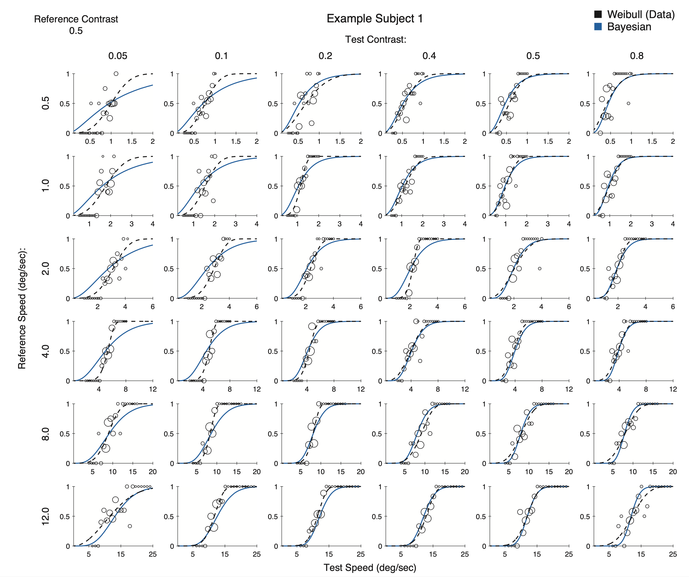
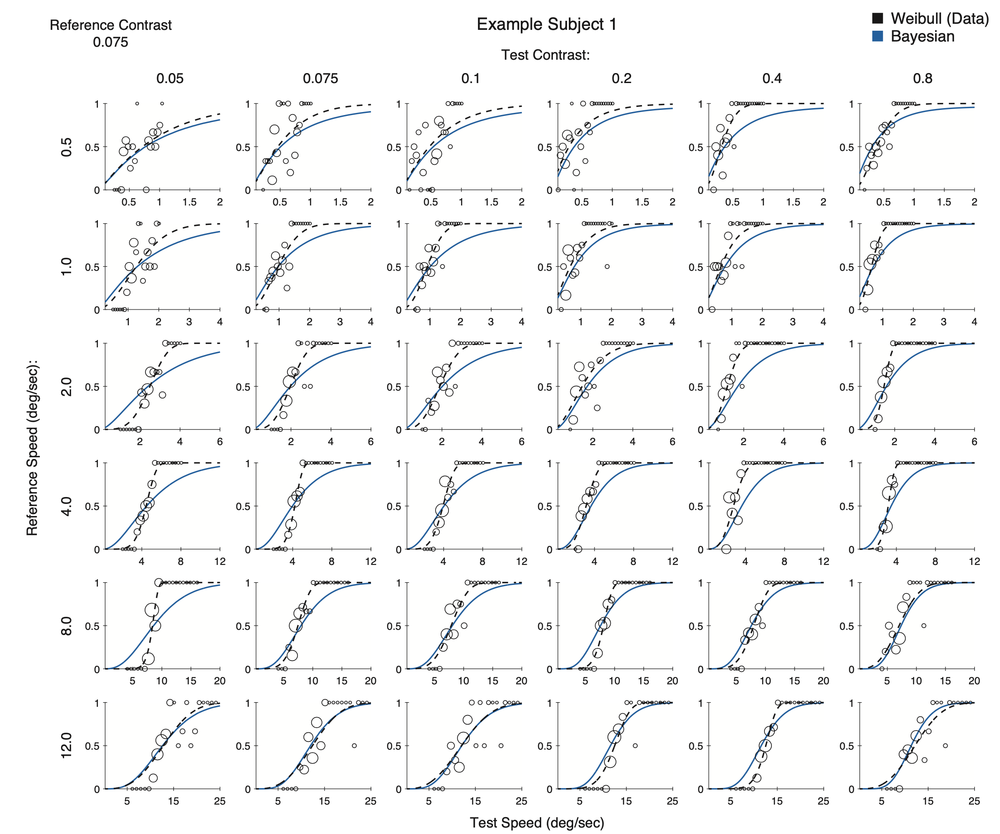

# Data and Analysis Code
  
**Prior expectations in visual speed perception predict encoding characteristics of neurons in area MT**  
Ling-Qi Zhang and Alan A. Stocker (2021)   
https://www.jneurosci.org/content/42/14/2951

For a quick tour of our project, you can see our VSS 2021 Poster:  
https://youtu.be/W5DH4h2dH8Y

## Code Usage
- Run `comparePrior.m` to plot and compare the behavior and neural prior

**Data/Model Fits for Individual Subject**
- Run `/behavior/plotPsycurves.m` for plotting the full set of psychometric curves of the data and model fits for invididual subjects  
- Here is an example for subject #1 

     

**Behavior Prior Analysis (Behavioral Prior)**
- Run `/behavior/mainOpt.m` for model fitting and extracting the behavior prior
- Subjects psychophysical data can be found under `/behavior/NN2006` 
- `model_para.mat` contains the best fit parameters for individual subjects

**Neural Prior Analysis (Neural Prior)**
- Run `/neural/fitDataGauss.m` for tuning curve fitting 
- Run `popuFisher.m` for the analysis of population Fisher Information (FI)
- Run `FisherCtrl.m` for additional analysis of FI with alternative models
- Run `fisherCorr.m` for FI analysis with a limited-range correlation model
- Data for individual neurons can be found under `/neural/DeAngelis` courtesy of Dr. Greg DeAngelis

## Contact 
For any comments or questions, feel free to contact me at **lingqiz at sas dot upenn dot edu**
